# DearImage

A class that represents a graphical image.

## setup

### npm

```shell
npm i dear-image
```

---

Install optionally to support Node.

```shell
npm i canvas
```

### ES module

```javascript
import DearImage from 'dear-image';
```

### Node

```javascript
let DearImage = require('dear-image');
```

### browser

```html
<script src="https://unpkg.com/dear-image"></script>
```

The module is globally available as `DearImage`.

## members

### static methods

`.isDearImage(value)`

Determines whether the passed value is an instance of `DearImage`.

| argument | description |
| ---: | :--- |
| `value` | The value to be checked. |

Returns `true` if the passed value is an instance of `DearImage`, `false` otherwise.

---

`.from(value)`

Creates a `DearImage` instance from the given value.

| argument | description |
| ---: | :--- |
| `value` | The value to create from. Supported value types are [`ImageData`](https://developer.mozilla.org/en-US/docs/Web/API/ImageData), [`HTMLCanvasElement`](https://developer.mozilla.org/en-US/docs/Web/API/HTMLCanvasElement), [`OffscreenCanvas`](https://developer.mozilla.org/en-US/docs/Web/API/OffscreenCanvas), [`HTMLImageElement`](https://developer.mozilla.org/en-US/docs/Web/API/HTMLImageElement), [`RenderingContext`](https://developer.mozilla.org/en-US/docs/Web/API/RenderingContext) and `DearImage`. |

Returns the created `DearImage` instance.

```javascript
let element = document.getElementById('myCanvas');
let image = DearImage.from(element);
document.body.appendChild(image.toHTMLCanvasElement());
```

---

`.loadFrom(value)`

Asynchronously loads a `DearImage` instance from the given value.

| argument | description |
| ---: | :--- |
| `value` | The value to load from. Supported value types are `String`, [`URL`](https://developer.mozilla.org/en-US/docs/Web/API/URL), [`Buffer`](https://nodejs.org/api/buffer.html), [`Blob`](https://developer.mozilla.org/en-US/docs/Web/API/Blob), [`HTMLImageElement`](https://developer.mozilla.org/en-US/docs/Web/API/HTMLImageElement) and everything the function `DearImage.from` supports. |

Returns a promise that resolves to the created `DearImage` instance.

```javascript
let url = '/path/to/image.jpg';
let image = await DearImage.loadFrom(url);
document.body.appendChild(image.toHTMLCanvasElement());
```

---

`.blank(sizeX = 0, sizeY = 0)`

Creates a `DearImage` instance without the content.

| argument | description |
| ---: | :--- |
| `sizeX` | A number as the width of the image. |
| `sizeY` | A number as the height of the image. |

Returns the created `DearImage` instance.

---

`.filled(style, sizeX = 0, sizeY = 0)`

Creates a `DearImage` instance with the filled content.

| argument | description |
| ---: | :--- |
| `style` | TODO: A string as the color or an instance of [`CanvasGradient`](https://developer.mozilla.org/en-US/docs/Web/API/CanvasGradient) or [`CanvasPattern`](https://developer.mozilla.org/en-US/docs/Web/API/CanvasPattern). |
| `sizeX` | A number as the width of the image. |
| `sizeY` | A number as the height of the image. |

Returns the created `DearImage` instance.

```
.drawed(image, sizeX = 0, sizeY = 0, options = {
  alignment: {
    x: 'center',
    y: 'center',
  },
  repeat: {
    x: false,
    y: false,
  },
})`
```


---

```
.drawed(image, sizeX = 0, sizeY = 0, options = {
  alignment: {
    x: 'center',
    y: 'center',
  },
  repeat: {
    x: false,
    y: false,
  },
})`
```

Creates a `DearImage` instance with the drawed content.

| argument | description |
| ---: | :--- |
| `image` | Anything the function `DearImage.from` supports. |
| `sizeX` | A number as the width of the image. |
| `sizeY` | A number as the height of the image. |
| `options.alignment` | An object with further options or a value. |
| `options.alignment.x` | A string as the horizontal alignment of the image. Possible values are `'start'`, `'center'` and `'end'`. |
| `options.alignment.y` | A string as the vertical alignment of the image. Possible values are `'start'`, `'center'` and `'end'`. |
| `options.repeat` | An object with further options or a value. |
| `options.repeat.x` | If `true`, repeats the image horizontally. |
| `options.repeat.y` | If `true`, repeats the image vertically. |

Returns the created `DearImage` instance.

```
let image = DearImage.drawed(image, sizeX = 0, sizeY = 0, {
  alignment: {
    x: 'center',
    y: 'center',
  },
  repeat: {
    x: false,
    y: false,
  },
})`
```


---

```
.loadFontFace(fontFace = {
  family: 'sans-serif',
  style: 'normal',
  variant: 'normal',
  weight: 'normal',
}, source)
```

Loads a font face.

| argument | description |
| ---: | :--- |
| `fontFace` | Either a string as the font family or an object with further options. |
| `fontFace.family` | A string as the font family. |
| `fontFace.style` | A string as the font style. |
| `fontFace.variant` | A string as the font variant. |
| `fontFace.weight` | A number or a string as the font weight. |
| `source` | TODO. A string as the source path to load from. The argument is required in Node and is optional in browser. |

Returns a promise.

---

```
.measureText(text = '', font = {
  family: 'sans-serif',
  size: 10,
  style: 'normal',
  variant: 'normal',
  weight: 'normal',
})
```

Creates a [`TextMetrics`](https://developer.mozilla.org/en-US/docs/Web/API/TextMetrics) instance representing the dimensions of the drawn text.

| argument | description |
| ---: | :--- |
| `text` | A string as the text. |
| `font.family` | A string as the font family. |
| `font.size` | A number as the font size. |
| `font.style` | A string as the font style. |
| `font.variant` | A string as the font variant. |
| `font.weight` | A number or a string as the font weight. |

Returns the created `TextMetrics` instance.

---

```
.text(text = '', options = {
  alignment: 'center',
  style: '#000',
  font: {
    family: 'sans-serif',
    size: 16,
    style: 'normal',
    variant: 'normal',
    weight: 'normal',
  },
  lineGap: 0.5,
  padding: 1.0,
  stroke: {
    style: '#000',
    width: 0,
  },
})
```

Creates a `DearImage` instance with the drawn text.

| argument | description |
| ---: | :--- |
| `text` | A string as the text. |
| `options.alignment` | TODO. |
| `options.fillStyle` | TODO: A string as the color or an instance of [`CanvasGradient`](https://developer.mozilla.org/en-US/docs/Web/API/CanvasGradient) or [`CanvasPattern`](https://developer.mozilla.org/en-US/docs/Web/API/CanvasPattern). |
| `options.fontFamily` | A string as the font family. |
| `options.fontSize` | A string as the font size. |
| `options.fontStyle` | A string as the font style. |
| `options.fontVariant` | A string as the font variant. |
| `options.fontWeight` | A number or a string as the font weight. |
| `options.lineGap` | A number as the gap between the text lines. The value is relative to the font size. |
| `options.padding` | A number as the space around the content. The value is relative to the font size. |
| `options.strokeStyle` | TODO: A string as the color or an instance of [`CanvasGradient`](https://developer.mozilla.org/en-US/docs/Web/API/CanvasGradient) or [`CanvasPattern`](https://developer.mozilla.org/en-US/docs/Web/API/CanvasPattern). |
| `options.strokeWidth` | A number as the width of the stroke. The value is relative to the font size. |

Returns the created `DearImage` instance.

```javascript
let fontFamily = 'Inconsolata';
await DearImage.loadFontFace(fontFamily, './fonts/Inconsolata.ttf');
let text = [
  'Twinkle, twinkle, little star,',
  'How I wonder what you are!',
  'Up above the world so high,',
  'Like a diamond in the sky.',
].join('\n');
let image = DearImage.text(text, {
  alignment: 'start',
  fillStyle: '#000',
  fontFamily,
  fontSize: 32,
  strokeStyle: '#000',
  strokeWidth: 4,
});
```


### properties

`.sizeX`

The width of the image.

```javascript
let image = DearImage.blank(300, 150);
console.log(image.sizeX); // => 300
```

---

`.sizeY`

The height of the image.

```javascript
let image = DearImage.blank(300, 150);
console.log(image.sizeY); // => 150
```

### methods

`.isBlank()`

Checks if the image is blank.

Returns `true` if the image is blank. Otherwise, `false`. todo

```javascript
let image = DearImage.blank(300, 150);
console.log(image.isBlank()); // => true
```

```javascript
let image = DearImage.filled('todo', 300, 150);
console.log(image.isBlank()); // => false
```

---

`.resize(sizeX = this.sizeX, sizeY = this.sizeY)`

Changes the size of the image.

| argument | description |
| ---: | :--- |
| `sizeX` | A number as the new width of the image. |
| `sizeY` | A number as the new height of the image. |

Returns the created `DearImage` instance.


---

`.resizeX(size = this.sizeY, proportionally = false)`

Changes the width of the image.

| argument | description |
| ---: | :--- |
| `size` | A number as the new width of the image. |
| `proportionally` | If `true`, the aspect ratio of the image is preserved. |

Returns the created `DearImage` instance.

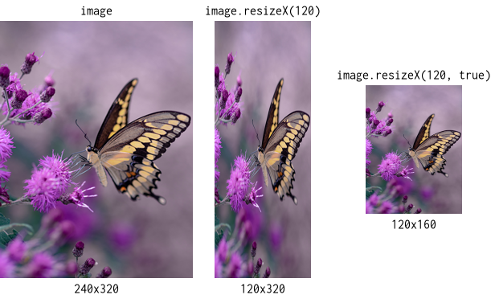

---

`.resizeY(size = this.sizeX, proportionally = false)`

Changes the height of the image.

| argument | description |
| ---: | :--- |
| `size` | A number as the new height of the image. |
| `proportionally` | If `true`, the aspect ratio of the image is preserved. |

Returns the created `DearImage` instance.

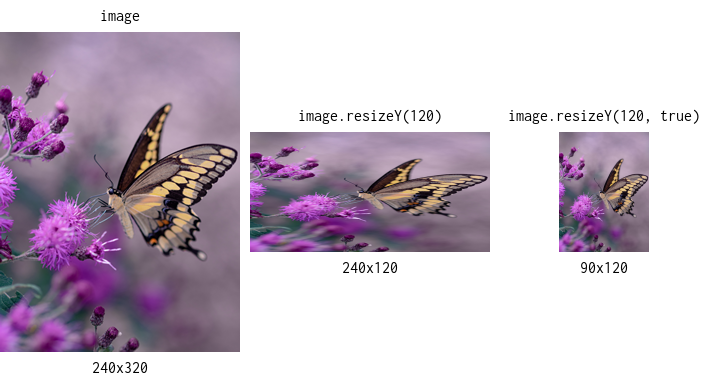

---

`.crop(startX = 0, startY = 0, sizeX = this.sizeX, sizeY = this.sizeY)`

Selects an area from the image.

| argument | description |
| ---: | :--- |
| `startX` | todo: A number as the horizontal offset of the area. A positive value indicates the offset from the left of the image. A negative value indicates the offset from the right of the image. |
| `startY` | todo: A number as the vertical offset of the area. A positive value indicates the offset from the top of the image. A negative value indicates the offset from the bottom of the image. |
| `sizeX` | todo: A number as the width of the area. A positive value selects an area from left to right. A negative value selects an area from right to left. |
| `sizeY` | todo: A number as the height of the area. A positive value selects an area from top to bottom. A negative value selects an area from bottom to top. |

Returns the created `DearImage` instance.

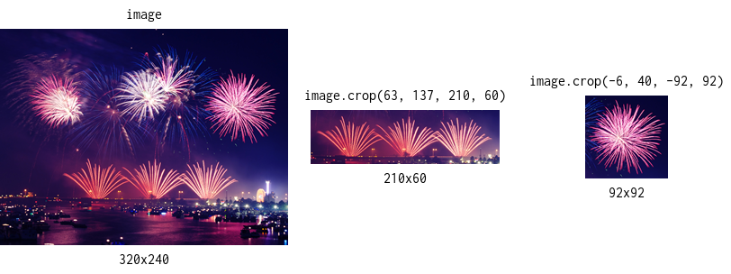

---

`.reframe(sizeX = this.sizeX, sizeY = this.sizeY, alignmentX = 'center', alignmentY = 'center')`

Aligns the image inside an area.

| argument | description |
| ---: | :--- |
| `sizeX` | A number as the width of the area. |
| `sizeY` | A number as the height of the area. |
| `alignmentX` | A string as the horizontal alignment of the image. Possible values are `'start'`, `'center'` and `'end'`. |
| `alignmentY` | A string as the vertical alignment of the image. Possible values are `'start'`, `'center'` and `'end'`. |

Returns the created `DearImage` instance.

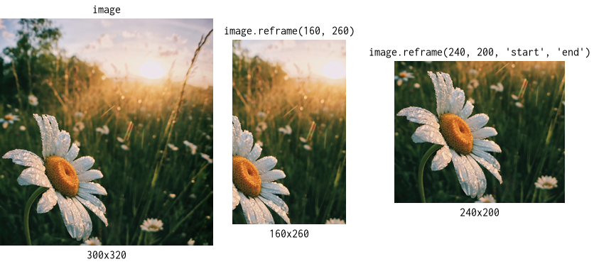

---

`.rescale(scalingX = 1, scalingY = 1)`

Changes the size of the image factorially.

| argument | description |
| ---: | :--- |
| `scalingX` | A number as the scaling factor for the width. |
| `scalingY` | A number as the scaling factor for the height. |

Returns the created `DearImage` instance.

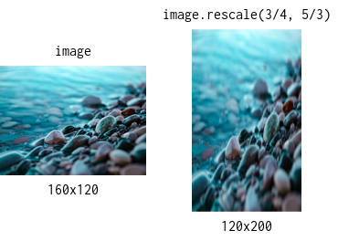

---

`.scale(scaling = 1)`

Changes the size of the image factorially. The aspect ratio of the image is preserved.

| argument | description |
| ---: | :--- |
| `scaling` | A number as the scaling factor. |

Returns the created `DearImage` instance.

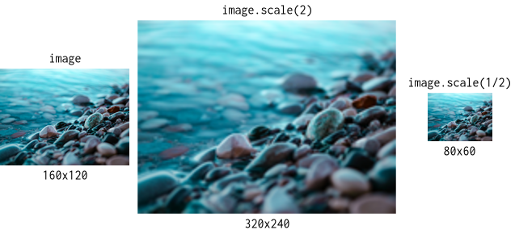

---

`.scaleIn(sizeX = this.sizeX, sizeY = this.sizeY)`

Scales the image inside an area. The aspect ratio of the image is preserved.

| argument | description |
| ---: | :--- |
| `sizeX` | A number as the width of the area. |
| `sizeY` | A number as the height of the area. |

Returns the created `DearImage` instance.

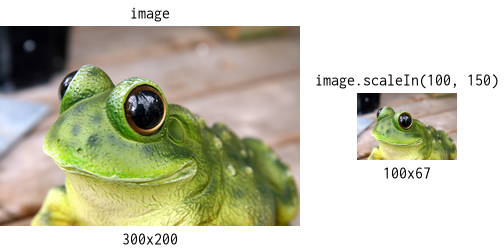

---

`.scaleOut(sizeX = this.sizeX, sizeY = this.sizeY)`

Scales the image outside an area. The aspect ratio of the image is preserved.

| argument | description |
| ---: | :--- |
| `sizeX` | A number as the width of the area. |
| `sizeY` | A number as the height of the area. |

Returns the created `DearImage` instance.

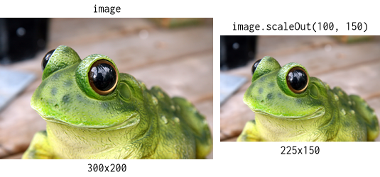

---

`.scaleDownIn(sizeX = this.sizeX, sizeY = this.sizeY)`

If necessary, scales the image down inside an area. The aspect ratio of the image is preserved.

| argument | description |
| ---: | :--- |
| `sizeX` | A number as the width of the area. |
| `sizeY` | A number as the height of the area. |

Returns the created `DearImage` instance.

---

`.scaleDownOut(sizeX = this.sizeX, sizeY = this.sizeY)`

If necessary, scales the image down outside an area. The aspect ratio of the image is preserved.

| argument | description |
| ---: | :--- |
| `sizeX` | A number as the width of the area. |
| `sizeY` | A number as the height of the area. |

Returns the created `DearImage` instance.

---

`.scaleUpIn(sizeX = this.sizeX, sizeY = this.sizeY)`

If necessary, scales the image up inside an area. The aspect ratio of the image is preserved.

| argument | description |
| ---: | :--- |
| `sizeX` | A number as the width of the area. |
| `sizeY` | A number as the height of the area. |

Returns the created `DearImage` instance.

---

`.scaleUpOut(sizeX = this.sizeX, sizeY = this.sizeY)`

If necessary, scales the image up outside an area. The aspect ratio of the image is preserved.

| argument | description |
| ---: | :--- |
| `sizeX` | A number as the width of the area. |
| `sizeY` | A number as the height of the area. |

Returns the created `DearImage` instance.

---

`.reframeScaleIn(sizeX = this.sizeX, sizeY = this.sizeY, alignmentX = 'center', alignmentY = 'center')`

todo: Scales the image inside an area and reframes.

| argument | description |
| ---: | :--- |
| `sizeX` | A number as the width of the area. |
| `sizeY` | A number as the height of the area. |
| `alignmentX` | A string as the horizontal alignment of the image. Possible values are `'start'`, `'center'` and `'end'`. |
| `alignmentY` | A string as the vertical alignment of the image. Possible values are `'start'`, `'center'` and `'end'`. |

Returns the created `DearImage` instance.


---

`.reframeScaleOut(sizeX = this.sizeX, sizeY = this.sizeY, alignmentX = 'center', alignmentY = 'center')`

todo: Scales the image outside an area. The aspect ratio of the image is preserved.

| argument | description |
| ---: | :--- |
| `sizeX` | A number as the width of the area. |
| `sizeY` | A number as the height of the area. |
| `alignmentX` | A string as the horizontal alignment of the image. Possible values are `'start'`, `'center'` and `'end'`. |
| `alignmentY` | A string as the vertical alignment of the image. Possible values are `'start'`, `'center'` and `'end'`. |

Returns the created `DearImage` instance.


---

`.flipX()`

Flips the image horizontally.

Returns the created `DearImage` instance.


---

`.flipY()`

Flips the image vertically.

Returns the created `DearImage` instance.


---

`.rotate(angle = 0)`

Rotates the image.

| argument | description |
| ---: | :--- |
| `angle` | A number as the angle of the rotation in radians. |

Returns the created `DearImage` instance.

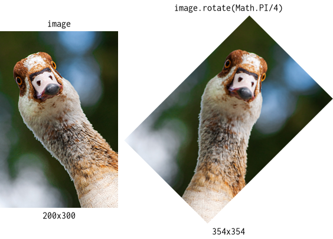

---

`.rotateClockwise()`

Rotates the image clockwise.

Returns the created `DearImage` instance.


---

`.rotateCounterClockwise()`

Rotates the image counter clockwise.

Returns the created `DearImage` instance.

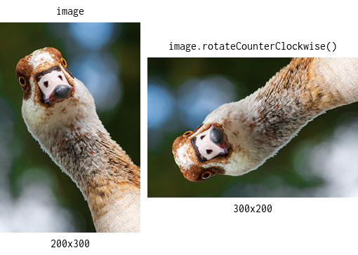

---

```
.drawForeground(image, options = {
  alignment: {
    x: 'center',
    y: 'center',
  },
  repeat: {
    x: false,
    y: false,
  },
})
```

Draws an image above the current image.

| argument | description |
| ---: | :--- |
| `image` | Anything the function `DearImage.from` supports. |
| `options.alignment` | An object with further options or a value. |
| `options.alignment.x` | A string as the horizontal alignment of the image. Possible values are `'start'`, `'center'` and `'end'`. |
| `options.alignment.y` | A string as the vertical alignment of the image. Possible values are `'start'`, `'center'` and `'end'`. |
| `options.repeat` | An object with further options or a value. |
| `options.repeat.x` | If `true`, repeats the image horizontally. |
| `options.repeat.y` | If `true`, repeats the image vertically. |

Returns the created `DearImage` instance.

```javascript
let image = DearImage.from(source).drawForeground(otherSource, {
  alignment: 'start',
  repeat: {
    y: true,
  },
});
```

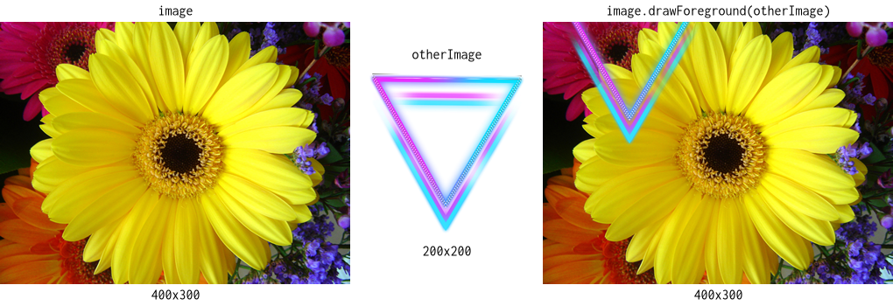

---

```
.drawBackground(image, options = {
  alignment: {
    x: 'center',
    y: 'center',
  },
  repeat: {
    x: false,
    y: false,
  },
})
```

Draws an image below the current image.

| argument | description |
| ---: | :--- |
| `image` | Anything the function `DearImage.from` supports. |
| `options.alignment.x` | A string as the horizontal alignment of the image. Possible values are `'start'`, `'center'` and `'end'`. |
| `options.alignment.y` | A string as the vertical alignment of the image. Possible values are `'start'`, `'center'` and `'end'`. |
| `options.repeat.x` | If `true`, repeats the image horizontally. |
| `options.repeat.y` | If `true`, repeats the image vertically. |

Returns the created `DearImage` instance.

```javascript
let image = DearImage.from(source).drawBackground(otherSource, {
  alignment: {
    x: 'end',
  },
  repeat: true,
});
```


---

`.fillForeground(style)`

Draws an image above the current image.

| argument | description |
| ---: | :--- |
| `style` | TODO: A string as the color or an instance of [`CanvasGradient`](https://developer.mozilla.org/en-US/docs/Web/API/CanvasGradient) or [`CanvasPattern`](https://developer.mozilla.org/en-US/docs/Web/API/CanvasPattern). |

Returns the created `DearImage` instance.


---

`.fillBackground(style)`

Draws an image below the current image.

| argument | description |
| ---: | :--- |
| `style` | TODO: A string as the color or an instance of [`CanvasGradient`](https://developer.mozilla.org/en-US/docs/Web/API/CanvasGradient) or [`CanvasPattern`](https://developer.mozilla.org/en-US/docs/Web/API/CanvasPattern). |

Returns the created `DearImage` instance.

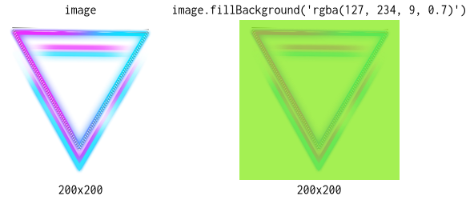

---

`.toDataURL(format, quality)`

Creates a [data URL](https://developer.mozilla.org/en-US/docs/Web/HTTP/Basics_of_HTTP/Data_URIs) string representing the content.

Returns the created data URL string.

---

`.toImageData()`

Creates an [`ImageData`](https://developer.mozilla.org/en-US/docs/Web/API/ImageData) object representing the content.

Returns the created `ImageData` object.


---

`.toBlob(format, quality)`

*browser only*

Creates a [`Blob`](https://developer.mozilla.org/en-US/docs/Web/API/Blob) instance representing the content.

Returns the created `Blob` instance.

---

`.toBuffer(format, quality)`

*Node only*

Creates a [`Buffer`](https://nodejs.org/api/buffer.html) instance representing the content.

Returns the created `Buffer` instance.

---

`.toHTMLCanvasElement()`

*browser only*

Creates a [`HTMLCanvasElement`](https://developer.mozilla.org/en-US/docs/Web/API/HTMLCanvasElement) instance representing the content.

Returns the created `HTMLCanvasElement` instance.

---

`.toOffscreenCanvas()`

*browser only*

Creates an [`OffscreenCanvas`](https://developer.mozilla.org/en-US/docs/Web/API/OffscreenCanvas) instance representing the content.

Returns the created `OffscreenCanvas` instance.

---

`.toHTMLImageElement(format, quality)`

*browser only*

Creates a [`HTMLImageElement`](https://developer.mozilla.org/en-US/docs/Web/API/HTMLImageElement) instance representing the content.

Returns the created `HTMLImageElement` instance.

```javascript
let image = DearImage.from(source);
let element = image.toHTMLImageElement('image/jpeg', 0.75);
element.style.border = '1px solid BlueViolet';
document.body.appendChild(element);
```

---

`.saveToFileSystem(target, format, quality)`

*Node only*

Asynchronously saves the content to the file system.

| argument | description |
| ---: | :--- |
| `target` | A string as the target path to save to. |

Returns a promise.

```javascript
let image = DearImage.from(source);
await image.saveToFileSystem('/path/to/image.jpg', 'image/jpeg', 0.75);
```

### utils

`.isURL(value)`

Determines whether the passed value is an instance of [`URL`](https://developer.mozilla.org/en-US/docs/Web/API/URL) or an URL string.

| argument | description |
| ---: | :--- |
| `value` | The value to be checked. |

Returns `true` if the passed value is an instance of `URL` or an URL string, `false` otherwise.

```javascript
console.log(DearImage.utils.isURL('https://github.com/SeregPie/DearImage'));
// => true

console.log(DearImage.utils.isURL(new URL('/SeregPie/DearImage', 'https://github.com')));
// => true

console.log(DearImage.utils.isURL('/SeregPie/DearImage')));
// => true in browser and false in node
```

---

`.isDataURL(value)`

Determines whether the passed value is a [data URL](https://developer.mozilla.org/en-US/docs/Web/HTTP/Basics_of_HTTP/Data_URIs) string.

| argument | description |
| ---: | :--- |
| `value` | The value to be checked. |

Returns `true` if the passed value is a data URL string, `false` otherwise.

```javascript
console.log(DearImage.utils.isDataURL('data:image/png;base64,R0lGODdh'));
// => true

console.log(DearImage.utils.isDataURL('data:,')));
// => true

console.log(DearImage.utils.isDataURL('data:image/png;base64')));
// => false
```
